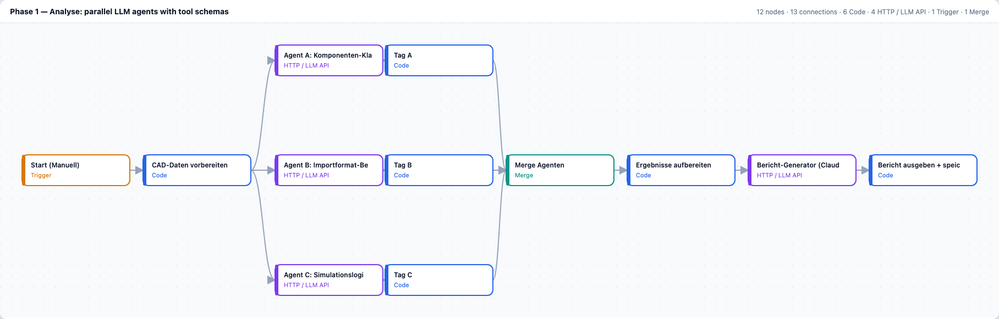
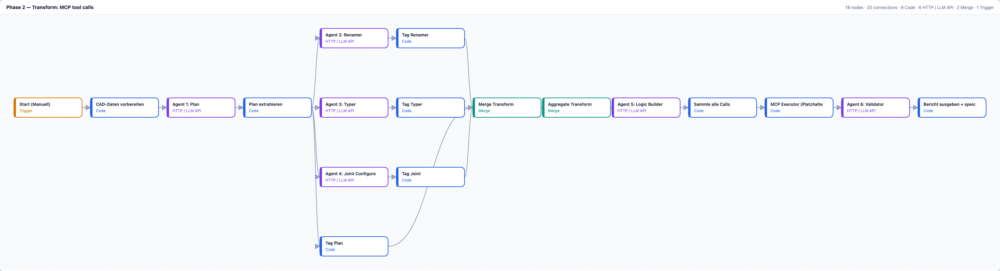

# LLM Agents for Virtual Commissioning — ZOLLERN

A two-phase agentic workflow that reads a CAD assembly description, classifies every
component through parallel LLM agents with enforced tool schemas, and emits a
structured feasibility report for an industrial simulation environment
(fe.screen-sim V5). Built for ZOLLERN GmbH & Co. KG as a university feasibility study
(HS Albstadt-Sigmaringen, Master DEC), spring 2026.

*Both rendered from the n8n exports in `sprints/sprint-1/SCRUM-40/`, positions and connections as in the files.*

## What it does

| Phase | Input | Agents | Output |
|---|---|---|---|
| 1 Analyse | CAD assembly description | classification, function, material | feasibility report (Markdown) with component table, open interface questions |
| 2 Transform | phase 1 report | logic design, joint mapping, tool calls | simulation configuration via MCP tool calls |

Every agent answer is forced through a declared tool schema
(`submit_hr_klassifikation`, `submit_lagerlogik`, …), so the pipeline never parses
free text. The MCP executor is a documented placeholder: the simulation vendor's
live endpoint was an external dependency that stayed open.

## Numbers

| Measurement | Value |
|---|---|
| n8n workflows | 5 (2 pipeline phases, 3 provider variants) |
| Workflow nodes, total | 126 |
| MCP tools specified | 11 |
| LLM providers compared on the same task | 3 (Claude, GPT, Gemini) |
| Sprint deliverables in this repo | 4 tickets, 3 sprints |

## Repo map

- `sprints/sprint-1/SCRUM-30/` — which CAD exchange formats survive LLM processing, and why (STEP, STL, Collada, ISO 10303)
- `sprints/sprint-1/SCRUM-31/` — what a language model can and cannot generate for a simulation artefact
- `sprints/sprint-1/SCRUM-32/` — limitations, stated as limitations rather than worked around
- `sprints/sprint-1/SCRUM-40/` — the workflows themselves, the MCP tool specification, the generated reports, a setup guide
- `sprints/sprint-2/` — a pointer: the Sprint 2 work is SCRUM-40 phase 2, filed under sprint-1
- `sprints/sprint-3/` — architecture, pipeline trace, model comparison (US9), prompts

## Stack

n8n for orchestration, HTTP tool calls against Claude / OpenAI / Gemini, MCP as the
interface to the simulation environment, Markdown reports as the artefact between
phases.

## Honest scope

- This is a **feasibility study**, not a production system. Phase 1 runs end to end;
  phase 2 is structurally complete but waits on a live simulation endpoint.
- **No customer data.** Every run uses a synthetic test plant
  (`Foerderer_Drehtisch_v1`). No CAD files, no PLC addresses, no pricing.
- **Client project.** ZOLLERN GmbH & Co. KG was the industrial partner; the study
  was carried out as coursework at HS Albstadt-Sigmaringen.
- **Team project.** This repo holds the workflow track (SCRUM-40 and the analysis
  tickets feeding it), written by Rustam Kohen. Other tracks (CAD parsing, the
  simulation-side MCP endpoint, testing) belong to other team members and are
  referenced by role, not by name.
- Credentials in the workflow JSON are n8n credential references, not values.

## License

Coursework, published for portfolio purposes. No warranty, no support.
